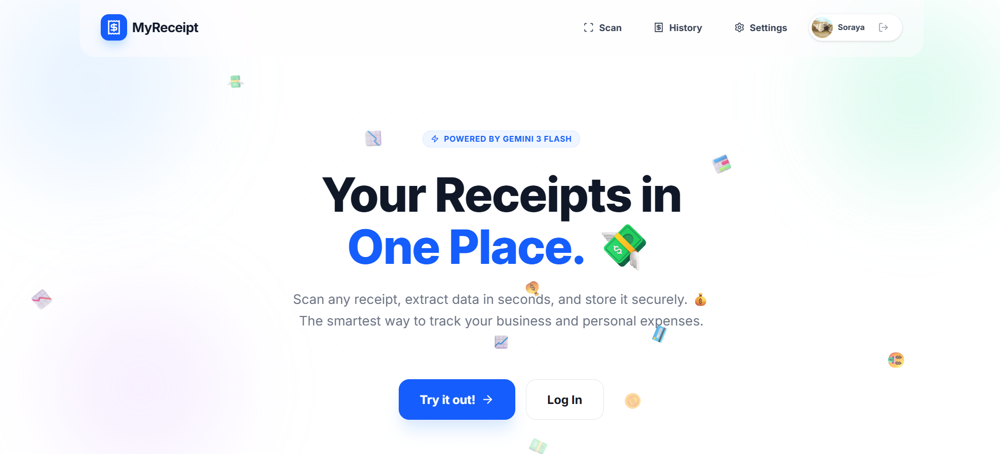

# MyReceipt 🧾

Smart receipt scanner that extracts merchant, date, and total amount using Google's AI. MyReceipt is built for speed, security, and absolute user data ownership.



## ✨ Core Features

### 🧠 Explainable AI (XAI)
Powered by **Gemini 3 Flash**, our scanning engine does more than just OCR. It understands the context of a receipt—distinguishing between tax, subtotal, and the final amount even on crumpled or blurry images. It identifies the merchant category and currency automatically, providing a structured summary that explains your spending.

### 🔐 Multi-Layered Security
- **Firebase Authentication**: Secure Google-only login ensures your data is tied strictly to your identity.
- **Eight-Pillar Firestore Rules**: Our database is protected by absolute Zero-Trust security rules, preventing update-gaps, ID poisoning, and unauthorized access.
- **Relational Integrity**: Access to sub-resources is strictly derived from the parent document's ownership.

### 📊 History & Analytics
- **Live History**: Instant access to all past scans with category-based filtering.
- **Spending Summary**: Real-time spending charts (Pie Charts) and total expense tracking.
- **PDF Export**: Generate branded, professional spending reports (Summary or Detailed) with visualization charts included.

### 👤 Data Ownership & Privacy
- **Total Control**: Edit any scanned field or category if the AI capture needs adjustment.
- **Export Anything**: Your data is yours; export your history to PDF at any time.
- **Account Deletion**: Request permanent account deletion with safe re-authentication (using Google Auth) to ensure only you can trigger a wipe of your data and authorization.

## 🛠️ Tech Stack & Dependencies

### Frontend
- **React 19 & Vite**: Ultra-fast modern rendering.
- **Tailwind CSS 4.0**: Utility-first styling with high-density mobile optimization.
- **Framer Motion (Motion/React)**: Fluid, purposeful UI transitions.
- **Lucide React**: Clean, consistent iconography.

### Services
- **Google Gemini SDK (`@google/genai`)**: The intelligence layer for vision and data extraction.
- **Firebase (`firebase`)**: Real-time NoSQL database (Firestore) and secure Identity Management.
- **jsPDF & jsPDF-AutoTable**: Client-side PDF generation for reports.

## 🚀 How to Run & Deploy

### 🏠 Local Development
1. **Install Dependencies**:
   ```bash
   npm install
   ```

2. **Setup Environment**:
   Create a `.env` file with your `GEMINI_API_KEY`.

3. **Run Dev Server**:
   ```bash
   npm run dev
   ```
   The app will start at `http://localhost:3000`.

### ☁️ Deployment

#### 1. Web Hosting (VERCEL / Production)
To deploy this application to Vercel:
1. Push your code to a GitHub repository.
2. Connect the repository to Vercel.
3. **CRITICAL**: Add the following Environment Variables in your Vercel Project Settings (values can be found in your Firebase and Google AI Console):
   - `GEMINI_API_KEY`: YOUR_GEMINI_API_KEY
   - `VITE_FIREBASE_API_KEY`: YOUR_FIREBASE_API_KEY
   - `VITE_FIREBASE_AUTH_DOMAIN`: YOUR_AUTH_DOMAIN
   - `VITE_FIREBASE_PROJECT_ID`: YOUR_PROJECT_ID
   - `VITE_FIREBASE_STORAGE_BUCKET`: YOUR_STORAGE_BUCKET
   - `VITE_FIREBASE_MESSAGING_SENDER_ID`: YOUR_SENDER_ID
   - `VITE_FIREBASE_APP_ID`: YOUR_APP_ID
   - `VITE_FIREBASE_DATABASE_ID`: YOUR_DATABASE_ID (Optional, usually `(default)`)
   - `APP_URL`: Your Vercel deployment URL (e.g., `https://your-app.vercel.app`)

```bash
npm run build
```
This generates a highly optimized `dist` folder ready for static serving.

#### 2. Firebase Security (Rules)
Ensure your data remains private by deploying the security specification to your project in the **asia-east1** region:
```bash
# Requires Firebase CLI
firebase deploy --only firestore:rules
```
*Note: Our `firestore.rules` file contains the logic for the Eight-Pillar security architecture.*

#### 3. AI Configuration
Ensure your deployment environment has the `GEMINI_API_KEY` configured to allow the @google/genai SDK (running in `server.ts`) to authenticate.
